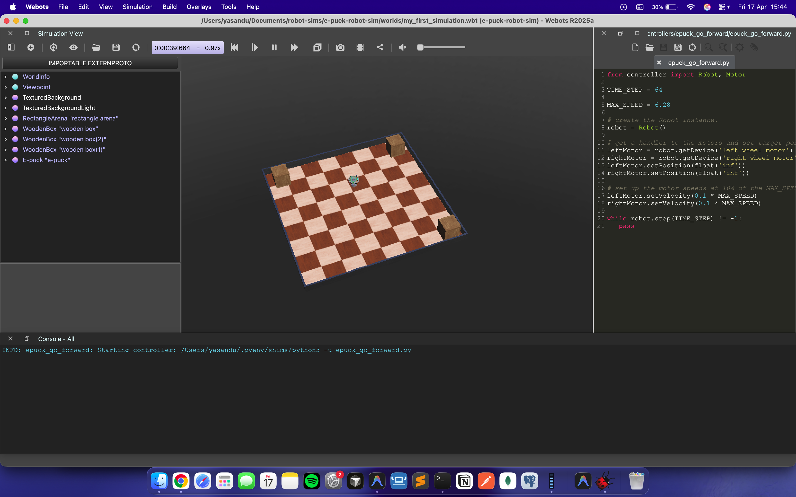

# e-puck robot simulation

## Getting Started

### Prerequisites

- [Webots](https://cyberbotics.com/) installed on your machine

### Installation

1. **Clone the repository**

   ```bash
   git clone https://github.com/yasandu0505/robotics-simulation-experiments.git
   ```

2. **Navigate into the project folder**

   ```bash
   cd robotics-simulation-experiments/e-puck-robot-sim
   ```

3. **Open the project in Webots**

   - Launch **Webots**
   - Go to **File → Open World...**
   - Browse to the project folder and select the `.wbt` `e-puck-robot-sim/worlds/my_first_simulation.wbt`
   - Click **Open**

The simulation should now load and be ready to run.

## Usage

Press the **Play** button in Webots to start the simulation.

